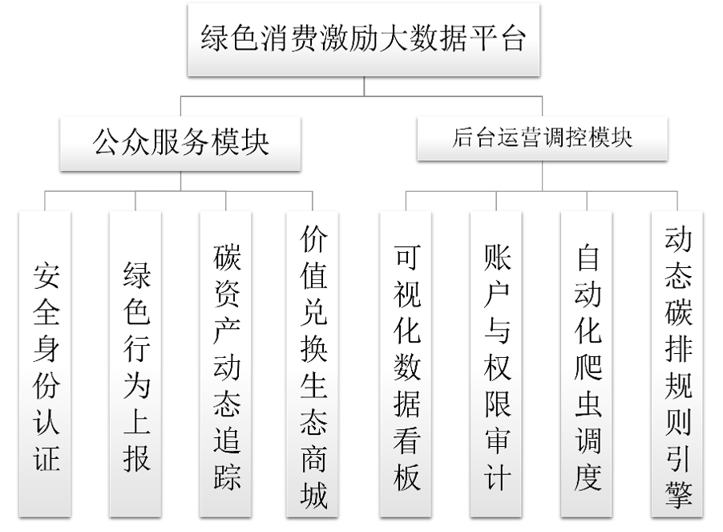
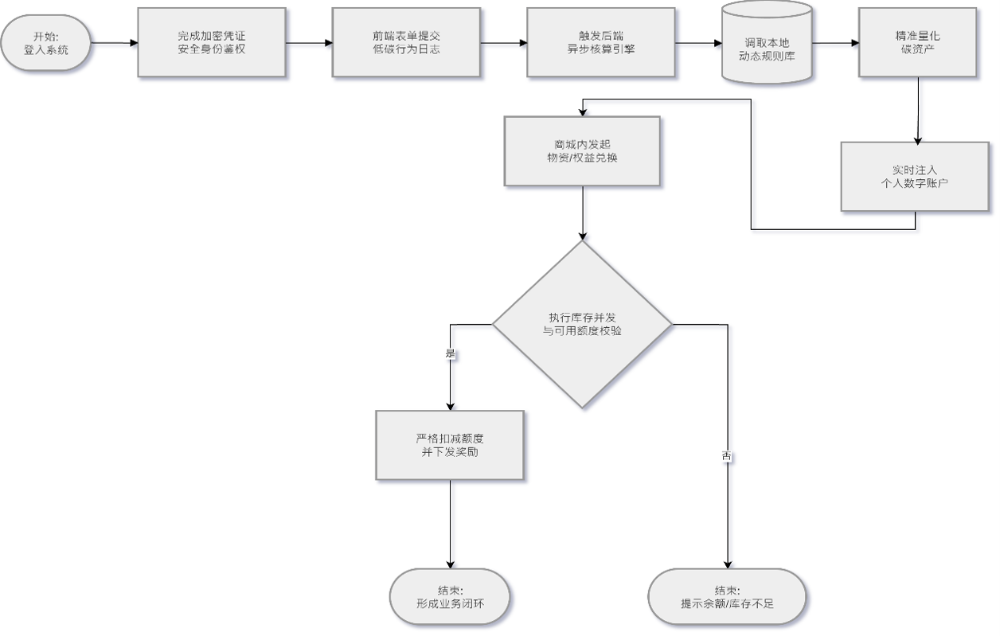
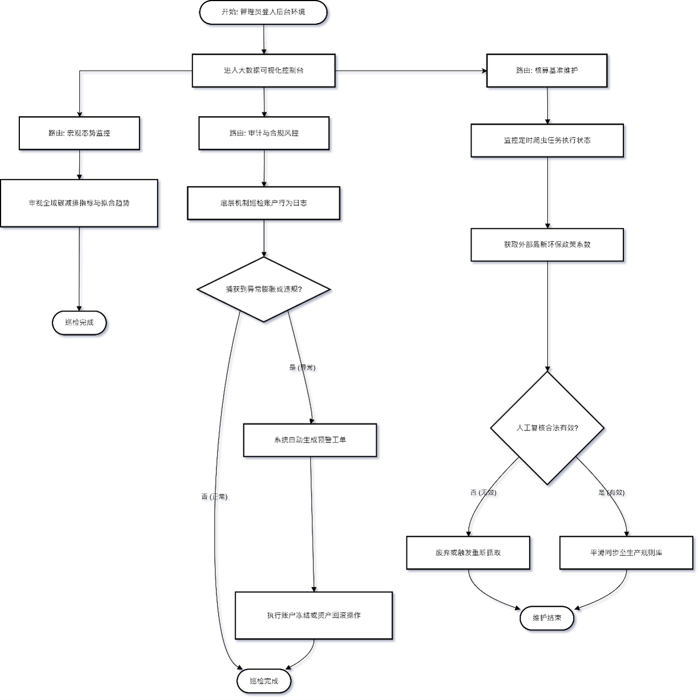
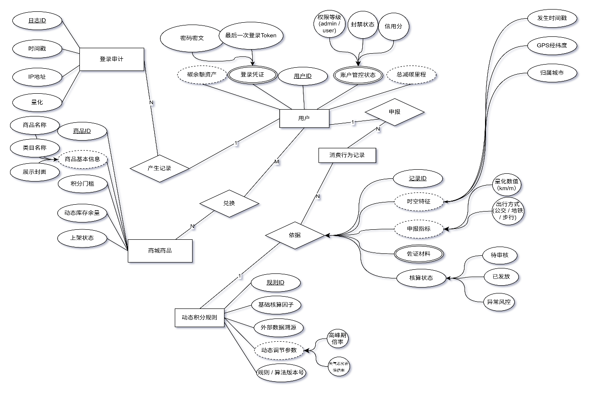

<h1 align="center">基于大数据的个人碳账户与绿色消费激励系统</h1>

<p align="center">
  
  
  
  
</p>

---

>  使用本项目之前，请先阅读本 README 内容，以便更好了解系统架构、启动环境及进行操作。

## 项目基本信息
- **Author**: RottanNeko
- **Code Time**: 2026/04/04
- **Update Time**: 2026/09/20
- ***版权声明：未经允许严禁转载此项目***

---

##  开源协议与可视化声明
本项目采用 Apache-2.0 开源协议，全平台图表与看板可视化均采用 [Apache ECharts](https://echarts.apache.org/)，使用与分发请自觉遵守开源协议规范。

---

## 技术栈总览
| 分层/模块 | 选用核心技术 | 端口 | 服务定位 |
| :--- | :--- | :--- | :--- |
| **数据中控台(B端)** | Next.js | `localhost:3000` | 管理端大数据看板 |
| **公众移动端(C端)** | Uni-app | `localhost:5173` | 移动优先 / H5 / 多端 |
| **服务端与引擎** | FastAPI | `localhost:8000` | 微服务接口与调度 |
| **数据与智能层** | MongoDB 异步驱动 | - | 高性能与自研算法预测分析 |

---

## Pydantic 作用
负责数据模型定义、请求参数校验与类型转换。

---

## 系统核心架构与业务流程

### 1. 系统功能架构设计图
系统采用表现层（双端分离）、业务接入层、服务编排层与数据计算分析层的现代化分层体系：


### 2. 用户端业务流程图 (User Flow)
涵盖用户注册/第三方登录、碳账户初始化、多模态绿色出行申报、碳足迹核算、排行榜挑战与碳积分商城兑换闭环：


### 3. 管理端业务流程图 (Admin Flow)
涵盖管理鉴权、大数据宏观监控、多维度时序分析、用户行为审计合规审查与激励策略动态配置：


### 4. 数据模型 E-R 图 (Entity-Relationship Diagram)
平台底层数据实体模型关系设计（用户主体、碳账户流水、绿色出行行为申报、积分商城商品、审计与日志字典）：


---

## 项目实机效果与界面画廊

### 1. 公众移动端(C端) 
<table>
  <tr>
    <td align="center" width="25%">
      <br />
      <b>起始引导页</b>
    </td>
    <td align="center" width="25%">
      <br />
      <b>账密与 OAuth 认证</b>
    </td>
    <td align="center" width="25%">
      <br />
      <b>今日减碳进度与打卡</b>
    </td>
    <td align="center" width="25%">
      <br />
      <b>减碳目标与排行榜</b>
    </td>
  </tr>
  <tr>
    <td align="center" width="25%">
      <br />
      <b>行动申报 - 绿色骑行</b>
    </td>
    <td align="center" width="25%">
      <br />
      <b>行动申报 - 城市轨道</b>
    </td>
    <td align="center" width="25%">
      <br />
      <b>绿色碳积分商城</b>
    </td>
    <td align="center" width="25%">
      <br />
      <b>积分流水与收支记录</b>
    </td>
  </tr>
</table>

### 2. 数据中控台(B端) 
<table>
  <tr>
    <td align="center" width="50%">
      <br />
      <b>宏观态势感知与全景数据看板</b>
    </td>
    <td align="center" width="50%">
      <br />
      <b>微观时序指标分析与趋势探测</b>
    </td>
  </tr>
  <tr>
    <td align="center" width="50%">
      <br />
      <b>核心 KPI 多维度横向聚合卡片</b>
    </td>
    <td align="center" width="50%">
      <br />
      <b>底层数据库字段与模型定义规范</b>
    </td>
  </tr>
</table>

---

## 架构版本更新

### ***V4.0*** 

本版本彻底拆分后台与移动端，双端独立运行部署。

| 更新内容 | 核心技术方案 | 架构特性与功能实现 |
| :--- | :--- | :--- |
| **公众移动端(C端)** | Uni-app | 面向移动端轻量交互，支持日常减碳打卡、绿色出行行为申报与碳积分商城兑换 |
| **数据中控台(B端)** | Next.js | 设立独立大数据可视化看板，支持宏观态势感知、微观时序指标分析与趋势监测 |
| **设备访问屏障** | 移动端访问壁垒 (Mobile Barrier) | 内置智能设备指纹与视口检测机制（`MobileBarrier`），拦截非桌面设备直接操作复杂数据大屏，强化访问合规 |
| **服务端精细鉴权** | FastAPI 路由体系升级 | 重构多版本路由，权限分离 |

**移除内容** 
* 清理运行日志与调试文件，避免配置文件及冗余跟踪项外泄

> 本次更新重构核心路由鉴权与双端架构，优化移动端轻量交互与设备访问控制，重绘 C 端移动界面与 B 端中控大屏 UI，完善工程隔离防御体系。

---

<details>
<summary>历史版本记录 (V1.0 - V3.0) </summary>
<br>

#### V3.0 移动端落地 
* C 端多端适配：开发移动端，打通单车、公交、地铁绿色出行打卡闭环。
* 碳中和资产体系：实现基于碳减排转换因子的自动化碳积分结算引擎与积分商城激励闭环。

#### V2.0 表现层分离与数据智能 
* 多端分工：确立用户端与运营管理端职能分工。
* 数据采集：引入轻量爬虫与调度器，定时爬取公共交通与城市骑行指标，动态校准减排换算系数。
* 时序预测：引入 Pandas 数据清洗流水线与 Prophet / 随机森林时序分析，预测碳减排走势与兑换峰值。

#### V1.0 基础微服务与三层架构 
* 表现层：现代化前端页面与 ECharts 图表。
* 业务层：FastAPI 异步服务与 JWT 认证。
* 数据层：MongoDB 配合异步驱动 Motor 支撑高频碳流水写入。

</details>

---

## 仓库核心目录结构
```text
CO2/
├── admin/                 # 数据中控台(B端) (Next.js)
│   ├── app/               # 页面与路由
│   ├── components/        # 模块化图表组件 (KpiGrid, TrendChart 等)
│   ├── lib/               # API 客户端与工具集
│   └── package.json
├── carbon-frontend/       # 公众移动端(C端) (Uni-app)
│   ├── src/pages/         # 页面 (今天打卡/行动申报/目标榜单/我的)
│   └── package.json
├── carbon_backend/        # 服务端与引擎 (FastAPI)
│   ├── main.py            # 业务路由与服务入口
│   ├── auth.py            # 鉴权与权限拦截
│   ├── models.py          # Pydantic 数据模式
│   ├── ml_engine.py       # 时序预测分析引擎
│   ├── database.py        # MongoDB 异步持久驱动
│   └── pyproject.toml     # 依赖与项目配置
└── README.md              # 项目总体架构与技术文档
```

---

## 部署方法

### 1. 启动服务端 (FastAPI)
进入服务端目录：
```bash
cd carbon_backend
```

**方式 A：普通 Python (venv + pip)**
```bash
python -m venv venv
# Windows:
.\venv\Scripts\activate
pip install -r requirements.txt
uvicorn main:app --reload --port 8000
```

**方式 B：UV 极速启动 (基于 pyproject.toml)**
```bash
# 依赖 pyproject.toml 自动化同步并启动
uv sync
uv run uvicorn main:app --reload --port 8000
```

### 2. 启动公众移动端 (Uni-app)
```bash
cd carbon-frontend
npm install
npm run dev:h5
# 访问地址: localhost:5173
```

### 3. 启动数据中控台 (Next.js)
```bash
cd admin
npm install
npm run dev
# 访问地址: localhost:3000
```

### 4. 演示测试账号
| 账号类型 | 用户名 | 默认密码 | 说明 |
| :--- | :--- | :--- | :--- |
| **数据中控台 (B端)** | `admin` | `admin123` | 管理端全景态势感知与大屏操作 |
| **公众移动端 (C端)** | `testuser` | `user` | 普通个人碳账户与绿色出行申报 |
